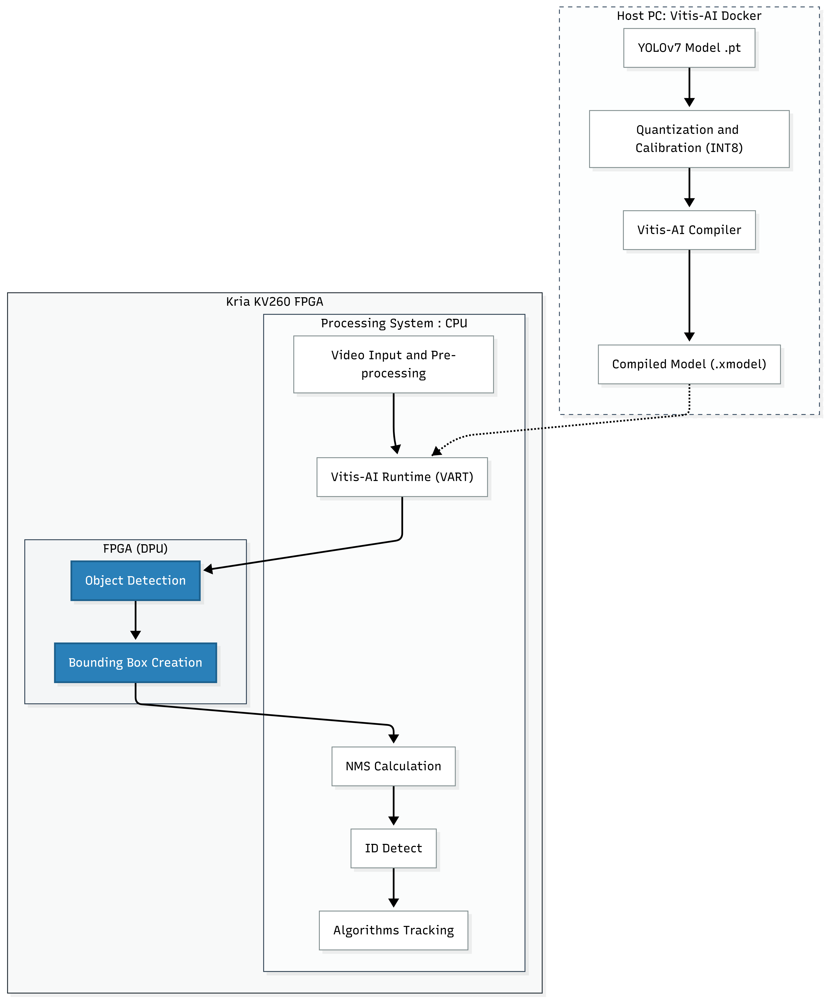
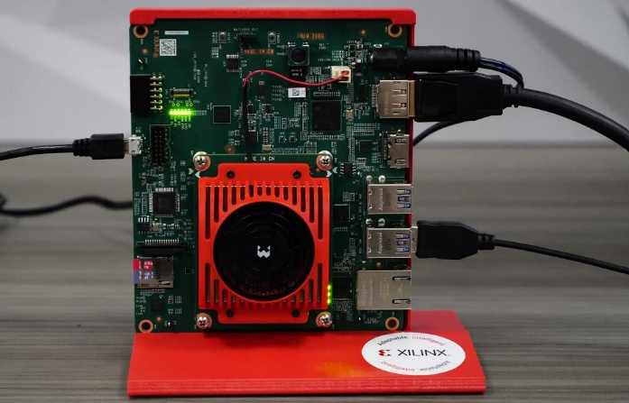

#  Defense Drone System with Real-Time Object Detection and Multi-Object Tracking

An embedded real-time aerial surveillance system for **military object detection and multi-object tracking**, based on a hardware–software co-design approach combining **Deep Learning, FPGA acceleration, DPU inference, and Tracking-by-Detection**.

The system was developed and evaluated on the **AMD Kria™ KV260 Vision AI Starter Kit**, using **YOLOv7-tiny quantized to INT8** and accelerated through the DPU.

---

##  Table of Contents

* [About The Project](#-about-the-project)
* [System Overview](#-system-overview)
* [Key Results](#-key-results)
* [Dataset](#-dataset)
* [Built With](#-built-with)
* [Project Structure](#-project-structure)
* [Getting Started](#-getting-started)

  * [Prerequisites](#prerequisites)
  * [Installation](#installation)
* [Training](#-training)

  * [Train YOLOv7-tiny](#train-yolov7-tiny)
  * [Validate the Model](#validate-the-model)
* [GPU Inference](#-gpu-inference)
* [Vitis AI Deployment](#-vitis-ai-deployment)

  * [Docker Environment](#1-create-the-vitis-ai-docker-container)
  * [Floating-Point Validation](#2-floating-point-validation)
  * [INT8 Calibration](#3-post-training-quantization-calibration)
  * [Quantized Model Validation](#4-int8-quantized-model-validation)
  * [Dump Quantized Model](#5-dump-the-quantized-model)
  * [DPU Compilation](#6-compile-the-model-for-the-dpu)
* [AMD Kria KV260 Setup](#-amd-kria-kv260-setup)

  * [PetaLinux](#1-prepare-the-petalinux-microsd-card)
  * [Boot the KV260](#2-boot-the-kv260)
  * [Verify the Platform](#3-verify-the-platform)
* [Tracking-by-Detection](#-tracking-by-detection)

  * [SORT](#sort)
  * [DeepSORT](#deepsort)
  * [ByteTrack](#bytetrack)
  * [BoT-SORT](#bot-sort)
* [Results & Benchmarks](#-results--benchmarks)

  * [GPU Detection Results](#1-detection-model-validation-gpu)
  * [DPU Detection Results](#2-detection-model-validation-dpu)
  * [Hardware Resource Consumption](#3-dpu-hardware-resource-consumption)
  * [GPU vs DPU](#4-gpu-vs-dpu)
  * [Tracking Results](#5-multi-object-tracking-results)
  * [Complete Pipeline](#6-complete-detection--tracking-pipeline)
* [Conclusion](#-conclusion)
* [Future Work](#-future-work)
* [References](#-references)
* [Contact](#-contact)

---

#  About The Project

This project investigates the development of an **autonomous embedded UAV perception system** capable of detecting and tracking multiple military-related targets in real time.


The main challenge is achieving real-time performance on an embedded platform with limited computational and energy resources.

To address this problem, the project combines:

* Deep learning-based object detection
* INT8 post-training quantization
* AMD Vitis AI
* FPGA-based DPU acceleration
* ARM CPU processing
* Multi-object tracking
* Hardware/software co-design

The final embedded implementation uses **YOLOv7-tiny + INT8 + DPU acceleration on the AMD Kria KV260**. The model achieved **52 FPS with 19 ms inference latency**, while consuming approximately **5.4 W** and using **36.8 MB** of memory.

---

#  System Overview

The complete system is divided between the **ARM processor** and the **FPGA-based DPU**.



The DPU performs the computationally intensive neural-network inference, while the ARM processor handles frame processing, post-processing, tracking and system coordination.

---

#  Key Results

| Metric                 |              Result |
| ---------------------- | ------------------: |
| Target Hardware        |  **AMD Kria KV260** |
| Final Detector         |     **YOLOv7-tiny** |
| Precision              |            **INT8** |
| DPU Inference          |          **52 FPS** |
| DPU Latency            |           **19 ms** |
| Power Consumption      |           **5.4 W** |
| Memory Usage           |         **36.8 MB** |
| Best Tracking FPS      |        **28.4 FPS** |
| Best HOTA              |   **50.29% — SORT** |
| Best MOTP              |   **77.16% — SORT** |
| Lowest ID Switches     |  **12 — ByteTrack** |
| Lowest False Positives | **216 — ByteTrack** |

The final system demonstrates that hardware acceleration can provide real-time embedded inference while significantly reducing power consumption compared with the GPU environment.

---

#  Dataset

The project uses the **Military Assets Dataset**, containing **26,315 annotated images** divided into training, validation and testing subsets.

**Dataset split:**

| Split      |     Images |
| ---------- | ---------: |
| Training   |     21,978 |
| Validation |      2,941 |
| Testing    |      1,396 |
| **Total**  | **26,315** |

The dataset contains **12 classes**, covering people, military vehicles, civilian objects and weapons.

**Dataset source:**

[Military Assets Dataset — 12 Classes, YOLOv8 Format](https://www.kaggle.com/datasets/rawsi18/military-assets-dataset-12-classes-yolo8-format)

### Dataset Structure

```text
dataset/
├── train/
│   ├── images/
│   │   ├── 01.jpg
│   │   ├── 02.jpg
│   │   └── ...
│   │
│   └── labels/
│       ├── 01.txt
│       ├── 02.txt
│       └── ...
│
├── val/
│   ├── images/
│   └── labels/
│
├── test/
│   ├── images/
│   └── labels/
│
└── military_dataset.yaml
```

Each image has a corresponding YOLO annotation file:

```text
images/01.jpg  →  labels/01.txt
images/02.jpg  →  labels/02.txt
```

YOLO annotation format:

```text
<class_id> <x_center> <y_center> <width> <height>
```

The dataset follows the standard YOLO structure with separate `images/` and `labels/` directories for training, validation and testing.

---

# Built With

### FPGA / Embedded AI

* **AMD Vitis AI 3.5**
* **NNDCT**
* **Vitis AI Quantizer**
* **Vitis AI Compiler**
* **Vitis AI Runtime (VART)**
* **Xilinx Runtime (XRT)**
* **AMD Kria™ KV260 Vision AI Starter Kit**
* **DPU**
* **ARM CPU**

### Development Environment

* Linux
* Ubuntu
* CUDA
* NVIDIA GPU
* Docker
* Conda / Miniconda


#  Getting Started

## Prerequisites

### Host PC / Training Server

Recommended environment:

* Linux / Ubuntu 20.04 or 22.04
* NVIDIA GPU with CUDA support
* Anaconda / Miniconda
* Docker
* Python 3.8
* PyTorch
* CUDA Toolkit

The model training and comparison experiments were performed using an NVIDIA GPU environment, including an **NVIDIA GeForce RTX 4080**.

### Target Hardware

* AMD Kria™ KV260 Vision AI Starter Kit
* Zynq UltraScale+ MPSoC
* ARM processor
* FPGA programmable logic
* DPU
* MicroSD card
* Ethernet connection
* PetaLinux / embedded Linux
* Vitis AI Runtime

---

## Installation

Clone the repository:

```bash
git clone https://github.com/A46628/Detection_And_Tracking_Real_Time.git
cd Detection_And_Tracking_Real_Time
cd yolov7
```

Create the Conda environment:

```bash
conda create -n drone-env python=3.8 -y
conda activate drone-env
```

Install the Python dependencies:

```bash
pip install -r yolov7\requirements.txt
```

---

#  Training

## Train YOLOv7-tiny

```bash
python yolov7\train.py \
    --workers 8 \
    --device 0 \
    --batch-size 16 \
    --data data/military_dataset.yaml \
    --img 640 640 \
    --cfg cfg/deploy/yolov7-tiny.yaml \
    --weights '' \
    --name yolov7-tiny-military
```

The best model is generated at:

```text
runs/train/yolov7-tiny-military/weights/best.pt
```


## Validate the Model

```bash
python yolov7\val.py \
    --weights runs/train/yolov7-tiny-military/weights/best.pt \
    --data data/military_dataset.yaml \
    --img 640 \
    --device 0
```

The validation process evaluates:

* Precision
* Recall
* mAP@0.5
* mAP@0.5:0.95

---

#  GPU Inference

### Single Image

```bash
python yolov7\detect.py \
    --weights runs/train/yolov7-tiny-military/weights/best.pt \
    --conf 0.25 \
    --img-size 640 \
    --source path/to/image.jpg
```

### Video

```bash
python yolov7\detect.py \
    --weights runs/train/yolov7-tiny-military/weights/best.pt \
    --conf 0.25 \
    --img-size 640 \
    --source path/to/video.mp4
```

### Webcam

```bash
python yolov7\detect.py \
    --weights runs/train/yolov7-tiny-military/weights/best.pt \
    --conf 0.25 \
    --img-size 640 \
    --source 0
```

---

#  Vitis AI Deployment

The deployment workflow converts the original FP32 model into a hardware-optimized **INT8 model** suitable for execution on the DPU.

```text
YOLOv7 FP32
     │
     ▼
Float Validation
     │
     ▼
PTQ Calibration
     │
     ▼
INT8 Quantization
     │
     ▼
Quantized Validation
     │
     ▼
Dump Quantized Model
     │
     ▼
Vitis AI Compiler
     │
     ▼
.xmodel
     │
     ▼
KV260 DPU
```

The project uses the AMD/Xilinx Vitis AI workflow for quantization and compilation. The report describes the use of Docker to isolate the Vitis AI environment and the conversion of the model from FP32 to INT8 for DPU execution.

---

## 1. Create the Vitis AI Docker Container

The quantization environment was created using the official **Xilinx Vitis AI CPU Docker image**:

[Xilinx Vitis AI CPU — Docker Hub](https://hub.docker.com/r/xilinx/vitis-ai-cpu)

Pull the image:

```bash
docker pull xilinx/vitis-ai-cpu:latest
```

Create the container:

```bash
docker run -it \
    --name vitis-ai-yolov7 \
    --hostname vitis-ai-container \
    -v $(pwd):/workspace \
    xilinx/vitis-ai-cpu:latest \
    /bin/bash
```

Enter the project:

```bash
cd /workspace/yolov7
```

If the container already exists:

```bash
docker start -ai vitis-ai-yolov7
```

---

## 2. Floating-Point Validation

Before quantization, the original FP32 model is evaluated:

```bash
python yolov7\test_nndct.py \
    --data data/yolov7/custom_dataset_calib.yaml \
    --img 640 \
    --batch 1 \
    --conf 0.001 \
    --iou 0.65 \
    --device 0 \
    --weights yolov7.pt \
    --name yolov7_640_val \
    --quant_mode float
```

This establishes the baseline performance before INT8 quantization.

---

## 3. Post-Training Quantization — Calibration

Calibration is performed using representative data:

```bash
python yolov7\test_nndct.py\
    --data data/yolov7/custom_dataset_calib.yaml \
    --img 640 \
    --batch 1 \
    --conf 0.001 \
    --iou 0.65 \
    --device 0 \
    --weights yolov7.pt \
    --name yolov7_640_val \
    --quant_mode calib
```

The calibration stage determines the quantization parameters required to convert the model from FP32 to INT8.

---

## 4. INT8 Quantized Model Validation

After calibration:

```bash
python yolov7\test_nndct.py \
    --data data/yolov7/custom_dataset_calib.yaml \
    --img 640 \
    --batch 1 \
    --conf 0.001 \
    --iou 0.65 \
    --device 0 \
    --weights yolov7.pt \
    --name yolov7_640_val \
    --quant_mode test
```

This evaluates the quantized model and allows its accuracy to be compared against the original FP32 model.

---

## 5. Dump the Quantized Model

The calibrated model is exported:

```bash
python yolov7\test_nndct.py \
    --data data/yolov7/custom_dataset_calib.yaml \
    --img 640 \
    --batch 1 \
    --conf 0.001 \
    --iou 0.65 \
    --device 0 \
    --weights yolov7.pt \
    --name yolov7_640_val \
    --quant_mode test \
    --dump_model
```

The dumped model is then prepared for compilation with the Vitis AI compiler.

---

## 6. Compile the Model for the DPU

After calibration and quantization, the INT8 model must be compiled for the target DPU architecture.

The Vitis AI compiler converts the quantized model into an `.xmodel` optimized for the target DPU.

Example:

```bash
vai_c_xir \
    -x <quantized_model>.xmodel \
    -a /opt/vitis-ai/compiler/arch/DPUCZDX8G/<target>/arch.json \
    -o ./compiled \
    -n yolov7_tiny_kv260
```

> **Important:** The `arch.json` must correspond to the actual DPU architecture configured on the target KV260 platform. The exact architecture file should therefore be verified against the deployed DPU overlay before compilation.

The final output is an `.xmodel` suitable for execution through Vitis AI Runtime.

---

#  AMD Kria™ KV260 Setup

The final embedded deployment targets the **AMD Kria™ KV260 Vision AI Starter Kit**.




The board integrates:

* Zynq UltraScale+ MPSoC
* ARM processing system
* FPGA programmable logic
* 4 GB DDR4
* MicroSD storage
* Gigabit Ethernet
* HDMI / DisplayPort
* DPU acceleration

The report describes the MicroSD card as the storage medium for the embedded operating system and configuration files, while Ethernet is used for SSH and remote file transfer.

---

## 1. Prepare the PetaLinux MicroSD Card

The PetaLinux image was obtained from the official AMD Embedded Software portal:

[AMD Embedded Software Downloads](https://www.amd.com/en/support/downloads/adaptive-socs-and-fpgas/embedded-software.html)

The **PetaLinux 2026.1** installer used during the setup is available here:

[PetaLinux 2026.1 Installer](https://account.amd.com/en/forms/downloads/xef.html?filename=petalinux-v2026.1-06061130-installer.run)

The image was transferred to a MicroSD card using **balenaEtcher**:

[balenaEtcher](https://etcher.balena.io/)

The process was:

```text
PetaLinux Image
      │
      ▼
balenaEtcher
      │
      ▼
MicroSD Card
      │
      ▼
AMD Kria KV260
      │
      ▼
PetaLinux Boot
```

### Procedure

1. Download the PetaLinux image from AMD.
2. Install and open balenaEtcher.
3. Insert the MicroSD card.
4. Select the PetaLinux image.
5. Select the MicroSD card as the target.
6. Flash the image.
7. Wait for the verification process.
8. Safely eject the MicroSD card.
9. Insert it into the KV260.
10. Power on the board.

> **Warning:** Flashing the image erases the selected MicroSD card.

---


#  Tracking-by-Detection

Object detection alone provides information for a single frame. To maintain target identity over time, the system uses the **Tracking-by-Detection** paradigm.

```text
Frame t
   │
   ▼
YOLOv7-tiny
   │
   ▼
Bounding Boxes
   │
   ▼
Data Association
   │
   ▼
Track IDs
   │
   ▼
Frame t+1
   │
   ▼
YOLOv7-tiny
   │
   ▼
Data Association
   │
   ▼
Updated Tracks
```

The implemented trackers are based on temporal prediction and data association using techniques such as the **Kalman Filter, IoU and Hungarian algorithm**.

---

<<<<<<< Updated upstream
## SORT
=======
For this project, the **PetaLinux 2026.1** installer was used:

[PetaLinux 2026.1 Installer](https://account.amd.com/en/forms/downloads/xef.html?filename=petalinux-v2026.1-06061130-installer.run&utm_source=chatgpt.com)

The downloaded PetaLinux image was then transferred to a **MicroSD card** using **balenaEtcher**.

**balenaEtcher:**

[Download balenaEtcher](https://etcher.balena.io/?utm_source=chatgpt.com)

balenaEtcher provides a simple three-step process for writing an operating-system image to removable storage: **select the image, select the target drive, and flash the image**. It also validates the flashing process after completion.

The process is:

1. Download the appropriate **PetaLinux image** from the AMD Embedded Software portal.
2. Install and open **balenaEtcher**.
3. Insert the MicroSD card into the host computer.
4. Select the downloaded PetaLinux image.
5. Select the MicroSD card as the target device.
6. Flash the image to the MicroSD card.
7. Wait for the validation process to complete.
8. Safely eject the MicroSD card.
9. Insert the MicroSD card into the **AMD Kria™ KV260**.
10. Power on the board and allow PetaLinux to boot.


##  Copy the Model and Video to the KV260

After compiling the model, copy the `.xmodel` file to the KV260.

For example, from the host PC:

```bash
scp yolo_tiny.xmodel <username>@<KV260_IP>:/home/<username>/models/
```

Copy the input video:

```bash
scp teste2.mp4 <username>@<KV260_IP>:/home/<username>/videos/
```

Then connect to the KV260:

```bash
ssh <username>@<KV260_IP>
```


##  Run the Application

Assuming the main application is saved as:

```text
dpu_tracking.py
```

the default execution is:

```bash
python3 dpu_tracking.py
```

By default, the application uses:

```text
Model:        yolo_tiny.xmodel
Video:        teste2.mp4
Tracker:      ByteTrack
Image size:   640 × 640
Confidence:   0.25
NMS threshold: 0.45
Output:       results_mot.txt
Socket host:  10.64.10.18
Socket port:  5000
```

---

#  Tracker Selection

The application supports three tracking algorithms:

```text
ByteTrack
DeepSORT
SORT
```

The tracker can be selected using:

```bash
--tracker
```

Available options:

```bash
--tracker bytetrack
--tracker deepsort
--tracker sort
```

---

## 6. Run with ByteTrack

ByteTrack is the default tracker.

```bash
python3 inference_DPU/main.py \
    --xmodel ~/models/yolo_tiny.xmodel \
    --video ~/videos/teste2.mp4 \
    --tracker bytetrack \
    --save-txt ~/results/bytetrack.txt
```

ByteTrack-specific parameters can be adjusted with:

```bash
--track-buffer 30
```

For example:

```bash
python3 inference_DPU/main.py \
    --xmodel ~/models/yolo_tiny.xmodel \
    --video ~/videos/teste2.mp4 \
    --tracker bytetrack \
    --track-buffer 30 \
    --conf-thresh 0.25 \
    --nms-thresh 0.45 \
    --save-txt ~/results/bytetrack.txt
```

---

##  Run with DeepSORT

To use DeepSORT:

```bash
python3 inference_DPU/main.py \
    --xmodel ~/models/yolo_tiny.xmodel \
    --video ~/videos/teste2.mp4 \
    --tracker deepsort \
    --save-txt ~/results/deepsort.txt
```

DeepSORT-specific parameters include:

```bash
--max-age 30
--n-init 3
```

Example:

```bash
python3 inference_DPU/main.py \
    --xmodel ~/models/yolo_tiny.xmodel \
    --video ~/videos/teste2.mp4 \
    --tracker deepsort \
    --max-age 30 \
    --n-init 3 \
    --conf-thresh 0.25 \
    --nms-thresh 0.45 \
    --save-txt ~/results/deepsort.txt
```

---

##  Run with SORT

To use SORT:

```bash
python3 inference_DPU/main.py \
    --xmodel ~/models/yolo_tiny.xmodel \
    --video ~/videos/teste2.mp4 \
    --tracker sort \
    --save-txt ~/results/sort.txt
```

SORT-specific parameters include:

```bash
--max-age 30
--min-hits 3
--iou-thresh 0.3
```

Example:

```bash
python3 inference_DPU/main.py \
    --xmodel ~/models/yolo_tiny.xmodel \
    --video ~/videos/teste2.mp4 \
    --tracker sort \
    --max-age 30 \
    --min-hits 3 \
    --iou-thresh 0.3 \
    --conf-thresh 0.25 \
    --nms-thresh 0.45 \
    --save-txt ~/results/sort.txt
```

---

#  Command-Line Arguments

The application provides the following parameters:

| Argument         | Default            | Description                      |
| ---------------- | ------------------ | -------------------------------- |
| `--xmodel`       | `yolo_tiny.xmodel` | Path to the compiled DPU model   |
| `--video`        | `teste2.mp4`       | Input video                      |
| `--host`         | `10.64.10.18`      | TCP socket server IP             |
| `--port`         | `5000`             | TCP socket port                  |
| `--img-size`     | `640`              | Neural network input resolution  |
| `--conf-thresh`  | `0.25`             | Detection confidence threshold   |
| `--nms-thresh`   | `0.45`             | NMS threshold                    |
| `--save-txt`     | `results_mot.txt`  | MOT output file                  |
| `--tracker`      | `bytetrack`        | Tracking algorithm               |
| `--track-buffer` | `30`               | ByteTrack track buffer           |
| `--max-age`      | `30`               | Maximum frames without detection |
| `--n-init`       | `3`                | DeepSORT track initialization    |
| `--min-hits`     | `3`                | SORT minimum detections          |
| `--iou-thresh`   | `0.3`              | SORT IoU association threshold   |

---

# 📡 TCP Socket Streaming

The application streams each processed frame through a TCP socket.

The connection is established using:

```python
s = socket.socket(socket.AF_INET, socket.SOCK_STREAM)
s.connect((args.host, args.port))
```

The processed frame is encoded as JPEG:

```python
_, jpeg = cv2.imencode(
    '.jpg',
    frame,
    [cv2.IMWRITE_JPEG_QUALITY, 70]
)
```

The image is then transmitted through the socket.


The IP address and port can be configured using:

```bash
--host <IP_ADDRESS>
--port <PORT>
```

For example:

```bash
python3 inference_DPU/main.py \
    --xmodel ~/models/yolo_tiny.xmodel \
    --video ~/videos/teste2.mp4 \
    --tracker bytetrack \
    --host IP_ADDRESS \
    --port 5000
```

> The receiving application must be running and listening on the specified IP address and TCP port before starting the DPU application.

---

#  MOT Output

The application can save tracking results in a MOT-style text file.

Enable output using:

```bash
--save-txt results_mot.txt
```

For example:

```bash
python3 dpu_tracking.py \
    --xmodel ~/models/yolo_tiny.xmodel \
    --video ~/videos/teste2.mp4 \
    --tracker bytetrack \
    --save-txt ~/results/bytetrack.txt
```

The output format is:

```text
<frame>,<id>,<bb_left>,<bb_top>,<bb_width>,<bb_height>,<conf>,<class>,<x>,<y>
```

Example:

```text
1,1,120.00,85.00,75.00,140.00,1,7,-1,-1
1,2,420.00,110.00,160.00,100.00,1,3,-1,-1
2,1,123.00,87.00,76.00,141.00,1,7,-1,-1
```

The file can subsequently be used to evaluate tracking performance using metrics such as:

* HOTA
* MOTA
* MOTP
* False Positives
* False Negatives
* Identity Switches
* Mostly Tracked
* Mostly Lost
---

#  Running All Trackers

For experimental comparison, the three trackers can be executed sequentially.

### ByteTrack

```bash
python3 dpu_tracking.py \
    --xmodel ~/models/yolo_tiny.xmodel \
    --video ~/videos/teste2.mp4 \
    --tracker bytetrack \
    --save-txt ~/results/bytetrack.txt
```

### DeepSORT

```bash
python3 dpu_tracking.py \
    --xmodel ~/models/yolo_tiny.xmodel \
    --video ~/videos/teste2.mp4 \
    --tracker deepsort \
    --save-txt ~/results/deepsort.txt
```

### SORT

```bash
python3 dpu_tracking.py \
    --xmodel ~/models/yolo_tiny.xmodel \
    --video ~/videos/teste2.mp4 \
    --tracker sort \
    --save-txt ~/results/sort.txt
```

The resulting files can then be compared using the MOT evaluation pipeline.

## Supported Trackers

### SORT
>>>>>>> Stashed changes

**Simple Online and Realtime Tracking**

SORT combines:

* Kalman Filter
* IoU-based association
* Hungarian algorithm

It is computationally lightweight and particularly suitable for resource-constrained embedded platforms.

---

## DeepSORT

DeepSORT extends SORT by introducing a deep appearance descriptor.

This improves identity association under occlusions but introduces a significant computational cost because an additional neural network must process the detected object crops.

---

## ByteTrack

ByteTrack uses both high-confidence and low-confidence detections during association.

This can improve robustness under:

* Partial occlusion
* Motion blur
* Low detector confidence
* Target crossings

ByteTrack achieved the **lowest number of identity switches** in the experiments.

---

## BoT-SORT

BoT-SORT was also investigated as an advanced tracking approach incorporating improved association strategies and camera-motion compensation.

The final quantitative embedded comparison focused on:

* SORT
* DeepSORT
* ByteTrack

---

#  Results & Benchmarks

## 1. Detection Model Validation — GPU

The initial model comparison was performed on the military dataset using GPU inference.

| Model           |   mAP@0.5 | mAP@0.5:0.95 | Precision |    Recall |     FPS |    Latency |
| --------------- | --------: | -----------: | --------: | --------: | ------: | ---------: |
| **YOLOv7-tiny** |     0.387 |        0.212 |     0.662 |     0.404 | **435** | **2.3 ms** |
| **YOLOv7**      | **0.629** |        0.424 |     0.683 | **0.610** |     278 |     3.6 ms |
| **YOLOv7x**     |     0.517 |        0.323 | **0.716** |     0.494 |     167 |     6.0 ms |
| **YOLOv8**      |     0.625 |        0.448 |     0.621 |     0.578 |     294 |     3.4 ms |
| **YOLO11x**     |     0.610 |        0.439 |     0.618 |     0.572 |      97 |    10.3 ms |
| **YOLO11m**     |     0.620 |    **0.455** |     0.630 |     0.583 |     232 |     4.3 ms |
| **YOLO11n**     |     0.560 |        0.375 |     0.695 |     0.502 |     370 |     2.7 ms |

YOLOv7 achieved the highest mAP@0.5, while YOLOv7-tiny achieved the highest processing speed.

---

## 2. Detection Model Validation — DPU

After INT8 quantization and deployment to the KV260:

| Model           | mAP@0.5 | mAP@0.5:0.95 | Precision | Recall |    FPS |   Latency |
| --------------- | ------: | -----------: | --------: | -----: | -----: | --------: |
| **YOLOv7-tiny** |   0.387 |        0.198 |     0.587 |  0.376 | **52** | **19 ms** |
| **YOLOv7**      |   0.591 |        0.356 |     0.647 |  0.583 |     10 |    104 ms |
| **YOLOv7x**     |   0.486 |        0.273 | **0.703** |  0.459 |      6 |    179 ms |

YOLOv7-tiny was selected as the final embedded detector because it was the only tested model capable of maintaining real-time performance on the DPU.

---

## 3. DPU Hardware Resource Consumption

| Metric        | YOLOv7-tiny |   YOLOv7 |  YOLOv7x |
| ------------- | ----------: | -------: | -------: |
| Power         |   **5.4 W** |   10.2 W |   10.9 W |
| Current       | **1068 mA** |  2020 mA |  2172 mA |
| Available CMA |     1535 MB |  1453 MB |  1388 MB |
| Used CMA      | **36.8 MB** | 116.9 MB | 179.8 MB |

The lightweight YOLOv7-tiny model provides the best balance between inference speed, memory consumption and energy efficiency.

---

## 4. GPU vs DPU

| Metric       | Hardware | YOLOv7-tiny |   YOLOv7 |  YOLOv7x |
| ------------ | -------- | ----------: | -------: | -------: |
| mAP@0.5      | GPU      |       0.387 |    0.629 |    0.517 |
|              | DPU      |       0.387 |    0.591 |    0.486 |
| mAP@0.5:0.95 | GPU      |       0.212 |    0.424 |    0.323 |
|              | DPU      |       0.198 |    0.356 |    0.273 |
| FPS          | GPU      |     **435** |      278 |      167 |
|              | DPU      |      **52** |       10 |        6 |
| Latency      | GPU      |      2.3 ms |   3.6 ms |   6.0 ms |
|              | DPU      |       19 ms |   104 ms |   179 ms |
| Power        | GPU      |        58 W |    134 W |    172 W |
|              | DPU      |   **5.4 W** |   10.2 W |   10.9 W |
| Memory       | GPU      |     376 MiB |  680 MiB |  966 MiB |
|              | DPU      | **36.8 MB** | 116.9 MB | 179.8 MB |

The GPU provides substantially higher raw throughput, while the DPU provides a much lower power budget suitable for embedded UAV applications. For YOLOv7-tiny, the system moves from **435 FPS at 58 W** on the GPU to **52 FPS at 5.4 W** on the DPU.

---

# 5. Multi-Object Tracking Results

| Metric            |  ByteTrack | DeepSORT |       SORT |
| ----------------- | ---------: | -------: | ---------: |
| **HOTA**          |     32.26% |   22.43% | **50.29%** |
| **MOTA**          | **59.42%** |   38.51% |     50.01% |
| **MOTP**          |     53.29% |   36.00% | **77.16%** |
| False Negatives   |       1459 |  **669** |        738 |
| False Positives   |    **216** |     1844 |       1291 |
| Identity Switches |     **12** |       43 |         49 |
| Mostly Tracked    |         45 |  **112** |         97 |
| Mostly Lost       |        241 |  **157** |        170 |

### Main Findings

**SORT**

* Highest HOTA: **50.29%**
* Highest MOTP: **77.16%**
* Low computational complexity
* Excellent spatial/geometric tracking performance

**ByteTrack**

* Highest MOTA: **59.42%**
* Lowest false positives: **216**
* Lowest identity switches: **12**
* Strong robustness under occlusions and low-confidence detections

**DeepSORT**

* High computational cost
* 1,844 false positives
* 43 identity switches
* Not suitable for real-time execution on the tested embedded configuration

---

# 6. Complete Detection + Tracking Pipeline

| Pipeline Stage        |    ByteTrack |   DeepSORT |         SORT |
| --------------------- | -----------: | ---------: | -----------: |
| Pre-processing — CPU  |      9.86 ms |    9.86 ms |      9.86 ms |
| Inference — DPU       |     19.01 ms |   19.01 ms |     19.01 ms |
| Post-processing — CPU |      2.80 ms |    2.80 ms |      2.80 ms |
| Tracking — CPU        |      4.02 ms | 2191.11 ms |  **3.50 ms** |
| **Total Latency**     | **35.69 ms** | 2222.78 ms | **35.17 ms** |
| **FPS**               |     **28.0** |   **0.45** |     **28.4** |

The results show that the DPU inference is only one component of the complete real-time pipeline. CPU-side post-processing and tracking can become the dominant bottleneck depending on the tracking algorithm.

---

#  Conclusion

The experiments demonstrate that **YOLOv7-tiny + INT8 + DPU acceleration** provides the best balance between detection performance, latency, power consumption and memory usage for the target embedded platform.

On the AMD Kria™ KV260, YOLOv7-tiny achieved:

```text
52 FPS
19 ms latency
5.4 W
36.8 MB memory
```

For multi-object tracking, **SORT** achieved the highest HOTA and MOTP, while **ByteTrack** achieved the highest MOTA and the lowest number of false positives and identity switches.

Considering identity robustness and the real-time constraint, the final analysis identifies **YOLOv7-tiny + ByteTrack** as a strong solution for tactical UAV surveillance, while **SORT** remains highly attractive when computational efficiency and spatial tracking precision are prioritized.


#  References

### Dataset

Madhuwala, R. *Military Assets Dataset (12 Classes - YOLO8 Format).* Kaggle, 2024.

[Military Assets Dataset](https://www.kaggle.com/datasets/rawsi18/military-assets-dataset-12-classes-yolo8-format)

### AMD / Xilinx

[AMD Embedded Software Downloads](https://www.amd.com/en/support/downloads/adaptive-socs-and-fpgas/embedded-software.html)

[PetaLinux 2026.1 Installer](https://account.amd.com/en/forms/downloads/xef.html?filename=petalinux-v2026.1-06061130-installer.run)

[AMD Kria™ KV260 Vision AI Starter Kit](https://www.amd.com/en/products/system-on-modules/kria/k26/kv260-vision-starter-kit.html)

[Vitis AI Documentation](https://xilinx.github.io/Vitis-AI/3.5/html/)

### Development Tools

[balenaEtcher](https://etcher.balena.io/)

[Xilinx Vitis AI CPU Docker Image](https://hub.docker.com/r/xilinx/vitis-ai-cpu)


