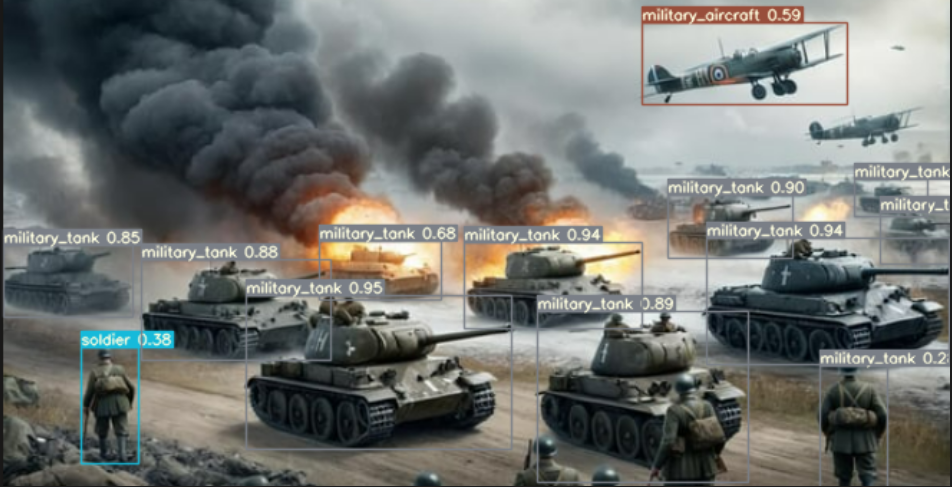

# Defense Drone System with Real-Time Object Detection and Multi-Object Tracking

Autonomous aerial surveillance and target tracking powered by **Deep Learning, FPGA acceleration, DPU inference, and Tracking-by-Detection**.

This project presents an embedded UAV perception system capable of performing **real-time military object detection and multi-object tracking** on resource-constrained hardware.

The system was developed and evaluated on the **AMD Kria™ KV260 Vision AI Starter Kit**, using **YOLOv7-tiny quantized to INT8** and accelerated through the **Deep Learning Processing Unit (DPU)**.

The final YOLOv7-tiny deployment achieved **52 FPS**, **19 ms inference latency**, approximately **5.4 W power consumption**, and **36.8 MB memory usage** on the KV260.




This project makes use of and adapts code from the following open-source repositories:

### YOLOv7

The code in the [`yolov7`](https://github.com/A46628/Detection_And_Tracking_Real_Time/tree/main/yolov7) directory was adapted from the original **YOLOv7** implementation by WongKinYiu.

Original repository:

[WongKinYiu/YOLOv7 — Implementation of YOLOv7](https://github.com/WongKinYiu/yolov7)

The original repository provides the YOLOv7 implementation used as the foundation for model training, validation, inference, and subsequent modifications required for the Vitis AI / DPU deployment.

### TrackEval

The code and evaluation workflow in the [`TrackEval`](https://github.com/A46628/Detection_And_Tracking_Real_Time/tree/main/TrackEval) directory were adapted from **TrackEval**, developed by Jonathon Luiten and contributors.

Original repository:

[JonathonLuiten/TrackEval — HOTA and other evaluation metrics for Multi-Object Tracking](https://github.com/JonathonLuiten/TrackEval)

TrackEval was used as the basis for evaluating the multi-object tracking results, including metrics such as **HOTA, MOTA, MOTP, False Positives, False Negatives, Identity Switches, Mostly Tracked, and Mostly Lost**.

---

## Table of Contents

* [About The Project](#about-the-project)
* [System Architecture](#system-architecture)
* [Key Results](#key-results)
* [Dataset](#dataset)
* [Built With](#built-with)
* [Project Structure](#project-structure)
* [Getting Started](#getting-started)

  * [Prerequisites](#prerequisites)
  * [Installation](#installation)
* [Training](#training)

  * [Train YOLOv7-tiny](#train-yolov7-tiny)
  * [Validate the Model](#validate-the-model)
* [GPU Inference](#gpu-inference)
* [Vitis AI Quantization and Compilation](#vitis-ai-quantization-and-compilation)

  * [Create the Vitis AI Docker Container](#1-create-the-vitis-ai-docker-container)
  * [Floating-Point Validation](#2-floating-point-validation)
  * [Post-Training Quantization Calibration](#3-post-training-quantization-calibration)
  * [INT8 Quantized Model Validation](#4-int8-quantized-model-validation)
  * [Dump the Quantized Model](#5-dump-the-quantized-model)
  * [Compile the Model for the DPU](#6-compile-the-model-for-the-dpu)
* [AMD Kria™ KV260 Setup](#amd-kria-kv260-setup)

  * [Prepare the PetaLinux MicroSD Card](#1-prepare-the-petalinux-microsd-card)
  * [Boot the KV260](#2-boot-the-kv260)
  * [Verify the Platform](#3-verify-the-platform)
* [Tracking-by-Detection](#tracking-by-detection)

  * [SORT](#sort)
  * [DeepSORT](#deepsort)
  * [ByteTrack](#bytetrack)
  * [BoT-SORT](#bot-sort)
* [DPU Detection and Tracking](#dpu-detection-and-tracking)

  * [Run the Application](#run-the-application)
  * [Tracker Selection](#tracker-selection)
  * [MOT Output](#mot-output)
  * [TCP Socket Streaming](#tcp-socket-streaming)
* [Results & Benchmarks](#results--benchmarks)

  * [1. Detection Model Validation (GPU)](#1-detection-model-validation-gpu)
  * [2. Detection Model Validation (DPU / Embedded FPGA)](#2-detection-model-validation-dpu--embedded-fpga)
  * [3. DPU Hardware Resource Consumption](#3-dpu-hardware-resource-consumption)
  * [4. GPU vs DPU Comparison](#4-gpu-vs-dpu-comparison)
  * [5. Multi-Object Tracking Results](#5-multi-object-tracking-results)
  * [6. Complete Detection + Tracking Pipeline](#6-complete-detection--tracking-pipeline)
* [Conclusion](#conclusion)
* [Future Work](#future-work)
* [References](#references)
* [Contact and Acknowledgements](#contact-and-acknowledgements)

---

## About The Project

The project focuses on the development of an autonomous embedded UAV defense and surveillance system capable of performing **real-time object detection and multi-object tracking**.

The system follows the **Tracking-by-Detection** paradigm:

1. A YOLO-based object detector processes each video frame.
2. Bounding boxes, class labels, and confidence scores are generated.
3. A tracking algorithm associates detections between consecutive frames.
4. A Kalman Filter predicts object motion.
5. Data association is performed using spatial information and, depending on the tracker, appearance information.
6. Each target is assigned and maintains a unique identity over time.

The final embedded implementation uses an **INT8-quantized YOLOv7-tiny model** deployed on the DPU of the **AMD Kria™ KV260 Vision AI Starter Kit**.

The project combines:

* Deep learning-based object detection
* YOLOv7 / YOLOv7-tiny model evaluation
* INT8 post-training quantization
* AMD Vitis AI
* FPGA-based DPU acceleration
* ARM CPU processing
* Multi-object tracking
* Hardware/software co-design

---

## System Architecture

The complete system is divided between the **ARM processor** and the **FPGA-based DPU**.


The DPU performs the computationally intensive neural-network inference, while the ARM processor handles frame processing, preprocessing, post-processing, tracking, communication, and system coordination.

The overall deployment pipeline is:

```text
YOLOv7 FP32
     │
     ▼
Floating-Point Validation
     │
     ▼
PTQ Calibration
     │
     ▼
INT8 Quantization
     │
     ▼
Quantized Model Validation
     │
     ▼
Dump Quantized Model
     │
     ▼
Vitis AI Compiler
     │
     ▼
.xmodel
     │
     ▼
AMD Kria KV260 DPU
     │
     ▼
Object Detection
     │
     ▼
Tracking-by-Detection
     │
     ├── SORT
     ├── DeepSORT
     └── ByteTrack
```

---

## Key Results

| Metric                     |                 Result |
| -------------------------- | ---------------------: |
| Target Hardware            |    **AMD Kria™ KV260** |
| Final Detector             |        **YOLOv7-tiny** |
| Precision                  |               **INT8** |
| DPU Inference              |             **52 FPS** |
| DPU Latency                |              **19 ms** |
| Power Consumption          |              **5.4 W** |
| Memory Usage               |            **36.8 MB** |
| Best Complete Pipeline FPS |    **28.4 FPS — SORT** |
| Best HOTA                  |      **50.29% — SORT** |
| Best MOTP                  |      **77.16% — SORT** |
| Highest MOTA               | **59.42% — ByteTrack** |
| Lowest ID Switches         |     **12 — ByteTrack** |
| Lowest False Positives     |    **216 — ByteTrack** |

These results demonstrate that a lightweight INT8 detector combined with DPU acceleration can provide real-time embedded inference while substantially reducing power and memory requirements.

---

# Dataset

The project uses the **Military Assets Dataset**, containing **26,315 annotated images** divided into training, validation, and testing subsets.

### Dataset Split

| Split      |     Images |
| ---------- | ---------: |
| Training   |     21,978 |
| Validation |      2,941 |
| Testing    |      1,396 |
| **Total**  | **26,315** |

The dataset contains **12 classes**, covering military personnel, vehicles, aircraft, ships, weapons, and civilian objects.

**Dataset source:**

[Military Assets Dataset — 12 Classes, YOLOv8 Format](https://www.kaggle.com/datasets/rawsi18/military-assets-dataset-12-classes-yolo8-format)

### Dataset Structure

```text
dataset/
├── train/
│   ├── images/
│   │   ├── 01.jpg
│   │   ├── 02.jpg
│   │   └── ...
│   │
│   └── labels/
│       ├── 01.txt
│       ├── 02.txt
│       └── ...
│
├── val/
│   ├── images/
│   └── labels/
│
├── test/
│   ├── images/
│   └── labels/
│
└── military_dataset.yaml
```

Each image has a corresponding YOLO annotation file:

```text
images/01.jpg  →  labels/01.txt
images/02.jpg  →  labels/02.txt
```

YOLO annotation format:

```text
<class_id> <x_center> <y_center> <width> <height>
```

---

# Built With

The project integrates the following frameworks, platforms, and toolchains:

* **Python**
* **PyTorch**
* **OpenCV**
* **YOLOv7 / YOLOv8 / YOLO11**
* **AMD Vitis AI 3.5**
* **Vitis AI Runtime (VART)**
* **Xilinx Runtime (XRT)**
* **AMD Kria™ KV260 Vision AI Starter Kit**
* **ARM CPU**
* **FPGA DPU**
* **Docker**

---

---

# Getting Started

## Prerequisites

### Host PC / Training Server

Recommended environment:

* Linux OS
* Ubuntu 20.04 / 22.04
* NVIDIA GPU with CUDA support
* Anaconda / Miniconda
* Docker
* PyTorch
* CUDA Toolkit

The training and model comparison experiments were performed using an NVIDIA GPU environment.

### Target Hardware

* AMD Kria™ KV260 Vision AI Starter Kit
* FPGA SoC
* ARM processor
* DPU
* PetaLinux / Linux-based environment
* Vitis AI Runtime (VART)
* Xilinx Runtime (XRT)

---

## Installation

### 1. Clone the Repository

```bash
git clone https://github.com/A46628/Detection_And_Tracking_Real_Time.git
cd Detection_And_Tracking_Real_Time
```

### 2. Create the Python Environment

```bash
conda create -n drone-env python=3.8 -y
conda activate drone-env
```

### 3. Install Dependencies

```bash
cd yolov7
pip install -r requirements.txt
```

---

# Training

## Train YOLOv7-tiny

The YOLOv7-tiny model can be trained using:

```bash
python train.py \
    --workers 8 \
    --device 0 \
    --batch-size 16 \
    --data data/military_dataset.yaml \
    --img 640 640 \
    --cfg cfg/deploy/yolov7-tiny.yaml \
    --weights '' \
    --name yolov7-tiny-military
```

The best model is generated at:

```text
runs/train/yolov7-tiny-military/weights/best.pt
```

---

## Validate the Model

```bash
python val.py \
    --weights runs/train/yolov7-tiny-military/weights/best.pt \
    --data data/military_dataset.yaml \
    --img 640 \
    --device 0
```

The validation process evaluates:

* Precision
* Recall
* mAP@0.5
* mAP@0.5:0.95

---

# GPU Inference

## Single Image

```bash
python detect.py \
    --weights runs/train/yolov7-tiny-military/weights/best.pt \
    --conf 0.25 \
    --img-size 640 \
    --source path/to/image.jpg
```

## Video

```bash
python detect.py \
    --weights runs/train/yolov7-tiny-military/weights/best.pt \
    --conf 0.25 \
    --img-size 640 \
    --source path/to/video.mp4
```

## Webcam

```bash
python detect.py \
    --weights runs/train/yolov7-tiny-military/weights/best.pt \
    --conf 0.25 \
    --img-size 640 \
    --source 0
```

---

# Vitis AI Quantization and Compilation

The YOLOv7 model was prepared for deployment on the **AMD Kria™ KV260 DPU** using the **AMD Vitis AI** workflow.

The deployment process converts the original floating-point model into an optimized INT8 model and subsequently compiles it for the target DPU architecture.

```text
FP32 Model
    │
    ▼
Float Validation
    │
    ▼
PTQ Calibration
    │
    ▼
INT8 Quantization
    │
    ▼
INT8 Validation
    │
    ▼
Dump Quantized Model
    │
    ▼
Vitis AI Compiler
    │
    ▼
.xmodel
```

---

## 1. Create the Vitis AI Docker Container

The quantization environment was created using the **Xilinx Vitis AI CPU Docker image**:

[Xilinx Vitis AI CPU — Docker Hub](https://hub.docker.com/r/xilinx/vitis-ai-cpu)

Pull the image:

```bash
docker pull xilinx/vitis-ai-cpu:latest
```

Create the container:

```bash
docker run -it \
    --name vitis-ai-yolov7 \
    --hostname vitis-ai-container \
    -v $(pwd):/workspace \
    xilinx/vitis-ai-cpu:latest \
    /bin/bash
```

Enter the YOLOv7 directory:

```bash
cd /workspace/yolov7
```

If the container already exists:

```bash
docker start -ai vitis-ai-yolov7
```

---

## 2. Floating-Point Validation

Before quantization, the original floating-point model is evaluated.

```bash
cd /workspace/yolov7

python test_nndct.py \
    --data data/yolov7/custom_dataset_calib.yaml \
    --img 640 \
    --batch 1 \
    --conf 0.001 \
    --iou 0.65 \
    --device 0 \
    --weights yolov7.pt \
    --name yolov7_640_val \
    --quant_mode float
```

This step establishes the baseline performance before quantization.

---

## 3. Post-Training Quantization Calibration

The next step performs **Post-Training Quantization (PTQ)** calibration.

```bash
cd /workspace/yolov7

python test_nndct.py \
    --data data/yolov7/custom_dataset_calib.yaml \
    --img 640 \
    --batch 1 \
    --conf 0.001 \
    --iou 0.65 \
    --device 0 \
    --weights yolov7.pt \
    --name yolov7_640_val \
    --quant_mode calib 
```

During calibration, representative data is used to determine the quantization parameters required to convert the model from floating-point representation to **INT8**.

---

## 4. INT8 Quantized Model Validation

After calibration, the quantized model is evaluated using:

```bash
cd /workspace/yolov7

python test_nndct.py \
    --data data/yolov7/custom_dataset_calib.yaml \
    --img 640 \
    --batch 1 \
    --conf 0.001 \
    --iou 0.65 \
    --device 0 \
    --weights yolov7.pt \
    --name yolov7_640_val \
    --quant_mode test 
```

This stage verifies the accuracy of the quantized INT8 model before deployment to the DPU.

---

## 5. Dump the Quantized Model

Finally, the quantized model is exported using the `--dump_model` option:

```bash
cd /workspace/yolov7

python test_nndct.py \
    --data data/yolov7/custom_dataset_calib.yaml \
    --img 640 \
    --batch 1 \
    --conf 0.001 \
    --iou 0.65 \
    --device 0 \
    --weights yolov7.pt \
    --name yolov7_640_val \
    --quant_mode test \
    --dump_model
```

The dumped quantized model is then prepared for compilation with the Vitis AI compiler.

---

## 6. Compile the Model for the DPU

After calibration and quantization, the INT8 model must be compiled for the target DPU architecture.

Example:

```bash
vai_c_xir \
    -x <quantized_model>.xmodel \
    -a /opt/vitis-ai/compiler/arch/DPUCZDX8G/<target>/arch.json \
    -o ./compiled \
    -n yolov7_tiny_kv260
```

> **Important:** `arch.json` must correspond to the DPU architecture configured on the target KV260 platform.

The final output is an `.xmodel` suitable for execution through Vitis AI Runtime.

---

# AMD Kria™ KV260 Setup

The final embedded deployment targets the **AMD Kria™ KV260 Vision AI Starter Kit**.


The KV260 platform provides the FPGA-based programmable logic and ARM processing system required for the embedded implementation.

The MicroSD card is used to store the embedded operating system and configuration files, while Ethernet is used for SSH sessions and remote file transfer.

---

## 1. Prepare the PetaLinux MicroSD Card

The PetaLinux image used for the KV260 setup was downloaded from the official AMD Embedded Software portal:

[AMD Embedded Software Downloads](https://www.amd.com/en/support/downloads/adaptive-socs-and-fpgas/embedded-software.html)

The **PetaLinux 2026.1 Installer** used during the setup is available here:

[PetaLinux 2026.1 Installer](https://account.amd.com/en/forms/downloads/xef.html?filename=petalinux-v2026.1-06061130-installer.run)

The image was transferred to a MicroSD card using **balenaEtcher**:

[balenaEtcher](https://etcher.balena.io/)

The process was:

```text
PetaLinux Image
      │
      ▼
balenaEtcher
      │
      ▼
MicroSD Card
      │
      ▼
AMD Kria KV260
      │
      ▼
PetaLinux Boot
```

### Procedure

1. Download the PetaLinux image from AMD.
2. Install and open balenaEtcher.
3. Insert the MicroSD card.
4. Select the PetaLinux image.
5. Select the MicroSD card as the target.
6. Flash the image.
7. Wait for the verification process.
8. Safely eject the MicroSD card.
9. Insert the MicroSD card into the KV260.
10. Power on the board and allow PetaLinux to boot.

> **Warning:** Flashing the image erases the selected MicroSD card.

---

## 2. Boot the KV260

After inserting the MicroSD card:

1. Connect the KV260 to the power supply.
2. Connect Ethernet if remote access is required.
3. Power on the board.
4. Allow PetaLinux to boot.
5. Connect to the board through the network.

SSH can be used to access the board:

```bash
ssh <username>@<KV260_IP>
```

---

## 3. Verify the Platform

After booting, verify that the Linux environment is running correctly.

The compiled `.xmodel` should then be transferred to the KV260.

For example, from the host PC:

```bash
scp yolo_tiny.xmodel <username>@<KV260_IP>:/home/<username>/models/
```

The input video can be transferred using:

```bash
scp teste2.mp4 <username>@<KV260_IP>:/home/<username>/videos/
```

---

# Tracking-by-Detection

Object detection provides information for individual frames. To maintain target identity over time, the system uses the **Tracking-by-Detection** paradigm.

```text
Frame t
   │
   ▼
YOLOv7-tiny
   │
   ▼
Bounding Boxes
   │
   ▼
Data Association
   │
   ▼
Track IDs
   │
   ▼
Frame t+1
   │
   ▼
YOLOv7-tiny
   │
   ▼
Data Association
   │
   ▼
Updated Tracks
```

The tracking layer receives:

* Bounding boxes
* Confidence scores
* Class IDs

and associates detections between consecutive frames.

---

## SORT

**Simple Online and Realtime Tracking**

SORT combines:

* Kalman Filter
* IoU-based association
* Hungarian algorithm

It is computationally lightweight and particularly suitable for resource-constrained embedded platforms.

---

## DeepSORT

DeepSORT extends SORT by introducing a deep appearance descriptor.

This improves identity association under occlusion but introduces a significant computational cost because an additional neural network processes the detected object crops.

---

## ByteTrack

ByteTrack uses both high-confidence and low-confidence detections during association.

This can improve robustness under:

* Partial occlusion
* Motion blur
* Low detector confidence
* Target crossings

ByteTrack achieved the **lowest number of identity switches** in the experiments.

---

## BoT-SORT

BoT-SORT was also investigated as an advanced SORT-based approach incorporating improved association strategies and camera-motion compensation.

The final quantitative embedded comparison focused on:

* SORT
* DeepSORT
* ByteTrack

---

# DPU Detection and Tracking

After deploying the `.xmodel` to the KV260, the complete detection and tracking application can be executed using:

```text
Input Video
     │
     ▼
Pre-processing
     │
     ▼
YOLOv7-tiny INT8
     │
     ▼
AMD DPU
     │
     ▼
Post-processing
     │
     ▼
Object Detections
     │
     ▼
Tracking Algorithm
     │
     ├── SORT
     ├── DeepSORT
     └── ByteTrack
     │
     ▼
Tracked Objects
     │
     ├── MOT Results
     └── TCP JPEG Stream
```

---

## Run the Application

The main application is located at:

```text
inference_DPU/main.py
```

A basic execution is:

```bash
python3 inference_DPU/main.py \
    --xmodel ~/models/yolo_tiny.xmodel \
    --video ~/videos/teste2.mp4 \
    --tracker bytetrack \
    --save-txt ~/results/bytetrack.txt \
    --host <IP_ADDRESS> \
    --port 5000
```

---

## Tracker Selection

### ByteTrack

```bash
python3 inference_DPU/main.py \
    --xmodel ~/models/yolo_tiny.xmodel \
    --video ~/videos/teste2.mp4 \
    --tracker bytetrack \
    --save-txt ~/results/bytetrack.txt
```

### DeepSORT

```bash
python3 inference_DPU/main.py \
    --xmodel ~/models/yolo_tiny.xmodel \
    --video ~/videos/teste2.mp4 \
    --tracker deepsort \
    --save-txt ~/results/deepsort.txt
```

### SORT

```bash
python3 inference_DPU/main.py \
    --xmodel ~/models/yolo_tiny.xmodel \
    --video ~/videos/teste2.mp4 \
    --tracker sort \
    --save-txt ~/results/sort.txt
```

---

## Command-Line Arguments

| Argument         | Default            | Description                      |
| ---------------- | ------------------ | -------------------------------- |
| `--xmodel`       | `yolo_tiny.xmodel` | Path to the compiled DPU model   |
| `--video`        | `teste2.mp4`       | Input video                      |
| `--host`         | `10.64.10.18`      | TCP socket server IP             |
| `--port`         | `5000`             | TCP socket server port           |
| `--img-size`     | `640`              | Neural network input resolution  |
| `--conf-thresh`  | `0.25`             | Detection confidence threshold   |
| `--nms-thresh`   | `0.45`             | NMS threshold                    |
| `--save-txt`     | `results_mot.txt`  | MOT output file                  |
| `--tracker`      | `bytetrack`        | Tracking algorithm               |
| `--track-buffer` | `30`               | ByteTrack track buffer           |
| `--max-age`      | `30`               | Maximum frames without detection |
| `--n-init`       | `3`                | DeepSORT track initialization    |
| `--min-hits`     | `3`                | SORT minimum detections          |
| `--iou-thresh`   | `0.3`              | SORT IoU association threshold   |

---

## MOT Output

The application can save tracking results in a MOT-style text file.

Enable output using:

```bash
--save-txt results_mot.txt
```

Example:

```bash
python3 inference_DPU/main.py \
    --xmodel ~/models/yolo_tiny.xmodel \
    --video ~/videos/teste2.mp4 \
    --tracker bytetrack \
    --save-txt ~/results/bytetrack.txt
```

The output format is:

```text
<frame>,<id>,<bb_left>,<bb_top>,<bb_width>,<bb_height>,<conf>,<class>,<x>,<y>
```

Example:

```text
1,1,120.00,85.00,75.00,140.00,1,7,-1,-1
1,2,420.00,110.00,160.00,100.00,1,3,-1,-1
2,1,123.00,87.00,76.00,141.00,1,7,-1,-1
```

The generated file can subsequently be used to evaluate:

* HOTA
* MOTA
* MOTP
* False Positives
* False Negatives
* Identity Switches
* Mostly Tracked
* Mostly Lost

---

## TCP Socket Streaming

The application streams the processed frames through a TCP socket.

The connection is configured using:

```bash
--host <IP_ADDRESS>
--port 5000
```

Example:

```bash
python3 inference_DPU/main.py \
    --xmodel ~/models/yolo_tiny.xmodel \
    --video ~/videos/teste2.mp4 \
    --tracker bytetrack \
    --host 10.64.10.18 \
    --port 5000
```

The processed frame is encoded as JPEG and transmitted through the TCP connection.

The receiving application must be running and listening on the specified IP address and port before starting the DPU application.

---

# Results & Benchmarks

## 1. Detection Model Validation (GPU)

The initial model comparison was performed on the military dataset using GPU inference.

| Model           |   mAP@0.5 | mAP@0.5:0.95 | Precision |    Recall |     FPS |    Latency |
| --------------- | --------: | -----------: | --------: | --------: | ------: | ---------: |
| **YOLOv7-tiny** |     0.387 |        0.212 |     0.662 |     0.404 | **435** | **2.3 ms** |
| **YOLOv7**      | **0.629** |        0.424 |     0.683 | **0.610** |     278 |     3.6 ms |
| **YOLOv7x**     |     0.517 |        0.323 | **0.716** |     0.494 |     167 |     6.0 ms |
| **YOLOv8**      |     0.625 |        0.448 |     0.621 |     0.578 |     294 |     3.4 ms |
| **YOLO11x**     |     0.610 |        0.439 |     0.618 |     0.572 |      97 |    10.3 ms |
| **YOLO11m**     |     0.620 |    **0.455** |     0.630 |     0.583 |     232 |     4.3 ms |
| **YOLO11n**     |     0.560 |        0.375 |     0.695 |     0.502 |     370 |     2.7 ms |

YOLOv7 achieved the highest **mAP@0.5**, while YOLOv7-tiny achieved the highest processing speed.

---

## 2. Detection Model Validation (DPU / Embedded FPGA)

After INT8 quantization and deployment to the KV260 DPU:

| Model           |   mAP@0.5 | mAP@0.5:0.95 | Precision |    Recall |    FPS |   Latency |
| --------------- | --------: | -----------: | --------: | --------: | -----: | --------: |
| **YOLOv7-tiny** | **0.387** |        0.198 |     0.587 |     0.376 | **52** | **19 ms** |
| **YOLOv7**      |     0.591 |    **0.356** |     0.647 | **0.583** |     10 |    104 ms |
| **YOLOv7x**     |     0.486 |        0.273 | **0.703** |     0.459 |      6 |    179 ms |

YOLOv7-tiny was selected as the final embedded detector because it was the only tested variant capable of maintaining real-time performance on the DPU.

---

## 3. DPU Hardware Resource Consumption

| Metric        | YOLOv7-tiny |   YOLOv7 |  YOLOv7x |
| ------------- | ----------: | -------: | -------: |
| Power         |   **5.4 W** |   10.2 W |   10.9 W |
| Current       | **1068 mA** |  2020 mA |  2172 mA |
| Available CMA |     1535 MB |  1453 MB |  1388 MB |
| Used CMA      | **36.8 MB** | 116.9 MB | 179.8 MB |

YOLOv7-tiny provides the best balance between inference speed, memory consumption, and energy efficiency.

---

## 4. GPU vs DPU Comparison

| Metric       | Hardware | YOLOv7-tiny |   YOLOv7 |  YOLOv7x |
| ------------ | -------- | ----------: | -------: | -------: |
| mAP@0.5      | GPU      |       0.387 |    0.629 |    0.517 |
|              | DPU      |       0.387 |    0.591 |    0.486 |
| mAP@0.5:0.95 | GPU      |       0.212 |    0.424 |    0.323 |
|              | DPU      |       0.198 |    0.356 |    0.273 |
| Precision    | GPU      |       0.662 |    0.683 |    0.716 |
|              | DPU      |       0.587 |    0.647 |    0.703 |
| Recall       | GPU      |       0.404 |    0.610 |    0.494 |
|              | DPU      |       0.376 |    0.583 |    0.459 |
| FPS          | GPU      |     **435** |      278 |      167 |
|              | DPU      |      **52** |       10 |        6 |
| Latency      | GPU      |      2.3 ms |   3.6 ms |   6.0 ms |
|              | DPU      |       19 ms |   104 ms |   179 ms |
| Power        | GPU      |        58 W |    134 W |    172 W |
|              | DPU      |   **5.4 W** |   10.2 W |   10.9 W |
| Memory       | GPU      |     376 MiB |  680 MiB |  966 MiB |
|              | DPU      | **36.8 MB** | 116.9 MB | 179.8 MB |

The GPU provides substantially higher raw throughput, while the DPU provides a much lower power budget suitable for embedded UAV applications. For YOLOv7-tiny, the system moves from **435 FPS at 58 W** on the GPU to **52 FPS at 5.4 W** on the DPU.

---

## 5. Multi-Object Tracking Results

The final tracking evaluation compared SORT, DeepSORT, and ByteTrack.

| Metric            |  ByteTrack | DeepSORT |       SORT |
| ----------------- | ---------: | -------: | ---------: |
| **HOTA**          |     32.26% |   22.43% | **50.29%** |
| **MOTA**          | **59.42%** |   38.51% |     50.01% |
| **MOTP**          |     53.29% |   36.00% | **77.16%** |
| False Negatives   |       1459 |  **669** |        738 |
| False Positives   |    **216** |     1844 |       1291 |
| Identity Switches |     **12** |       43 |         49 |
| Mostly Tracked    |         45 |  **112** |         97 |
| Mostly Lost       |        241 |  **157** |        170 |

### Main Findings

**SORT**

* Highest HOTA: **50.29%**
* Highest MOTP: **77.16%**
* Low computational complexity
* Excellent spatial/geometric tracking performance

**ByteTrack**

* Highest MOTA: **59.42%**
* Lowest false positives: **216**
* Lowest identity switches: **12**
* Strong robustness under occlusions and low-confidence detections

**DeepSORT**

* High computational cost
* 1,844 false positives
* 43 identity switches
* Not suitable for real-time execution on the tested embedded configuration

---

## 6. Complete Detection + Tracking Pipeline

| Pipeline Stage        |    ByteTrack |   DeepSORT |         SORT |
| --------------------- | -----------: | ---------: | -----------: |
| Pre-processing — CPU  |      9.86 ms |    9.86 ms |      9.86 ms |
| Inference — DPU       |     19.01 ms |   19.01 ms |     19.01 ms |
| Post-processing — CPU |      2.80 ms |    2.80 ms |      2.80 ms |
| Tracking — CPU        |      4.02 ms | 2191.11 ms |  **3.50 ms** |
| **Total Latency**     | **35.69 ms** | 2222.78 ms | **35.17 ms** |
| **FPS**               |     **28.0** |       0.45 |     **28.4** |

The complete system demonstrates that DPU inference is only one component of the real-time pipeline. CPU-side post-processing and tracking can become the dominant bottleneck depending on the tracking algorithm.

---

# Conclusion

The experiments demonstrate that **YOLOv7-tiny + INT8 + DPU acceleration** provides an effective balance between detection performance, latency, power consumption, and memory usage for the target embedded platform.

On the AMD Kria™ KV260, YOLOv7-tiny achieved:

```text
52 FPS
19 ms latency
5.4 W power consumption
36.8 MB memory usage
```

For multi-object tracking, **SORT** achieved the highest HOTA and MOTP, while **ByteTrack** achieved the highest MOTA and the lowest number of false positives and identity switches.

The final results show that:

* **SORT** is highly attractive when computational efficiency and spatial tracking precision are prioritized.
* **ByteTrack** provides stronger identity consistency and fewer false positives.
* **DeepSORT** is computationally expensive on the tested embedded configuration because its appearance extraction network runs on the CPU.

Considering the balance between computational efficiency, tracking robustness, and embedded hardware constraints, **YOLOv7-tiny + ByteTrack** represents a strong solution for tactical UAV surveillance, while **YOLOv7-tiny + SORT** provides the best measured spatial tracking performance.

---

# Future Work

Potential future improvements include:

* Mapping the DeepSORT appearance extraction network onto the DPU.
* Further optimization of CPU-side post-processing.
* Optimization of the TCP streaming pipeline.
* Integration with UAV navigation and flight-control systems.
* Evaluation under more challenging aerial conditions.
* Further optimization of model architecture for embedded deployment.
* Investigation of more advanced tracking and re-identification methods.

---

# References

### Dataset

Madhuwala, R. *Military Assets Dataset (12 Classes - YOLO8 Format).* Kaggle, 2024.

[Military Assets Dataset — 12 Classes, YOLOv8 Format](https://www.kaggle.com/datasets/rawsi18/military-assets-dataset-12-classes-yolo8-format)

### AMD / Xilinx

[AMD Embedded Software Downloads](https://www.amd.com/en/support/downloads/adaptive-socs-and-fpgas/embedded-software.html)

[PetaLinux 2026.1 Installer](https://account.amd.com/en/forms/downloads/xef.html?filename=petalinux-v2026.1-06061130-installer.run)

[AMD Kria™ KV260 Vision AI Starter Kit](https://www.amd.com/en/products/system-on-modules/kria/k26/kv260-vision-starter-kit.html)

[Vitis AI Documentation](https://xilinx.github.io/Vitis-AI/3.5/html/)

### Development Tools

[balenaEtcher](https://etcher.balena.io/)

[Xilinx Vitis AI CPU Docker Image](https://hub.docker.com/r/xilinx/vitis-ai-cpu)

---

# Contact and Acknowledgements

This project was developed as part of an embedded AI research project focused on real-time object detection, multi-object tracking, and hardware acceleration for UAV applications.

The project makes use of the **AMD Kria™ KV260 Vision AI Starter Kit**, **AMD Vitis AI**, **YOLOv7**, and the **Military Assets Dataset**.
